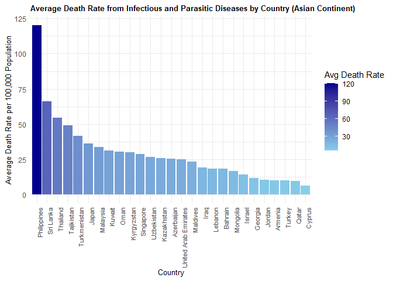

<!-- README.md is generated from README.Rmd. Please edit that file -->

# diseasesdeathrate

<!-- badges: start -->
<!-- badges: end -->

The goal of diseasesdeathrate is to provide data on age-standardized
death rates from infectious and parasitic diseases across various Asian
countries, as recorded by the World Health Organization (WHO). This
dataset allows users to explore and analyze health trends specific to
Asian regions, supporting public health research and data analysis in
the context of infectious diseases.

## Installation

You can install the development version of diseasesdeathrate from
[GitHub](https://github.com/) with:

``` r
remotes::install_github("ETC5523-2024/assignment-4-packages-and-shiny-apps-yasin27mohammad/diseasesdeathrate")
#> Skipping install of 'diseasesdeathrate' from a github remote, the SHA1 (227cf2d3) has not changed since last install.
#>   Use `force = TRUE` to force installation
```

## Example

This is a basic example which shows you how to solve a common problem:

``` r
library(diseasesdeathrate)
library(ggplot2)
#> Warning: package 'ggplot2' was built under R version 4.3.3
library(dplyr)
#> 
#> Attaching package: 'dplyr'
#> The following objects are masked from 'package:stats':
#> 
#>     filter, lag
#> The following objects are masked from 'package:base':
#> 
#>     intersect, setdiff, setequal, union

avg_death_rate <- infectious_parasitic_diseases_death_rate %>%
  group_by(Entity) %>%
  summarize(avg_death_rate = mean(`death rate per 100,000 population`, na.rm = TRUE))

# Plot the average death rate per country

ggplot(avg_death_rate, aes(x = reorder(Entity, -avg_death_rate), y = avg_death_rate, fill = avg_death_rate)) +
  geom_col() +
  scale_fill_gradient(low = "skyblue", high = "darkblue") + # Color gradient for fill
  labs(title = "Average Death Rate from Infectious and Parasitic Diseases by Country (Asian Continent)",
       x = "Country",
       y = "Average Death Rate per 100,000 Population") +
  theme_minimal() +
  theme(
    axis.text.x = element_text(angle = 90, hjust = 1, size = 8), 
    plot.title = element_text(size = 10, face = "bold"), 
    axis.title = element_text(size = 9.5),
    legend.position = "right"
  ) +
  guides(fill = guide_colorbar(title = "Avg Death Rate"))
```


